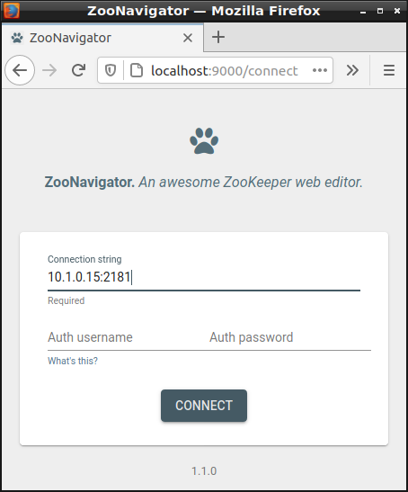

# zookeeper-k8s

## Description

This [Juju charm](https://juju.is/docs) deploys
[Apache ZooKeeper](https://zookeeper.apache.org/) on top of Kubernetes. It is
implemented using the [Charmed Operator Framework](https://juju.is/docs/sdk),
designed to deploy a standard [OCI](https://opencontainers.org/) (e.g. Docker)
ZooKeeper image alongside a sidecar container containing the Juju operator
logic.

Apache ZooKeeper is a service for storing the configuration (key-value store) of
a distributed system and helping with synchronization between components of that
system. This is for example used by [Zuul](https://zuul-ci.org/docs/zuul/),
OpenStack's CI system.

## Usage

### Deploying

```
$ juju add-model myzookeeper
$ juju deploy zookeeper-k8s --resource zookeeper-image=zookeeper
```

Where:

* `zookeeper-image`: [OCI](https://opencontainers.org/) (e.g. Docker) ZooKeeper
  image. Use `zookeeper` for the
  [latest image from DockerHub](https://hub.docker.com/_/zookeeper)

### Inspecting/Operating

```
$ juju status
Model        Controller  Cloud/Region        Version  SLA          Timestamp
myzookeeper  micro       microk8s/localhost  2.9.0    unsupported  12:10:38Z

App            Version  Status  Scale  Charm          Store  Channel  Rev  OS          Address  Message
zookeeper-k8s           active      1  zookeeper-k8s  local             0  kubernetes

Unit              Workload  Agent  Address    Ports  Message
zookeeper-k8s/0*  active    idle   10.1.0.15
```

```
$ kubectl get pods --namespace=myzookeeper
NAME                             READY   STATUS    RESTARTS   AGE
modeloperator-5d4469d7dc-q299q   1/1     Running   0          10m
zookeeper-k8s-0                  2/2     Running   0          7m44s
```

```
$ sudo snap install zoonavigator  # ZooKeeper Web-UI hosted here:
$ firefox http://localhost:9000
```



## Developing

Create and activate a virtualenv with the development requirements:

```
$ virtualenv -p python3 venv
$ source venv/bin/activate
$ pip install -r requirements-dev.txt
```

### Testing

The Python operator framework includes a very nice harness for testing
operator behaviour without full deployment. Just `run_tests`:

```
$ ./run_tests
```

### Deploying from source

```
$ charmcraft pack
$ juju deploy ./zookeeper-k8s.charm --resource zookeeper-image=zookeeper
```
